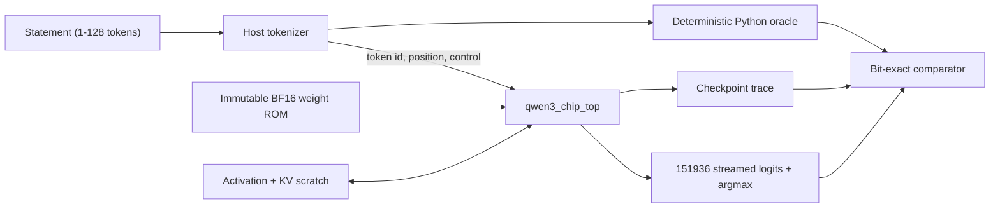

# Plan: real RTL forward pass for Qwen3-0.6B

## Objective

Accept an arbitrary statement of 1 to 128 tokens, execute the complete
Qwen3-0.6B dense forward pass in synthesizable RTL using the official
unquantized BF16 weights held as immutable on-chip ROM, and prove the RTL
result is bit-identical to a deterministic Python reference at every mandatory
checkpoint and across all 151936 final logits.

## Invariants

These hold in every phase and are never relaxed to make a milestone pass.

- All 28 layers execute. No layer is skipped, folded, or approximated.
- Geometry stays at H=1024, I=3072, NH=16, NKV=8, HD=128, V=151936.
- Weights are native BF16 from the official checkpoint, addressed as immutable
  ROM constants. Simulation may initialize a never-written ROM array from file;
  the host never supplies, streams, or writes weights at runtime.
- The runtime host supplies token IDs, position and control only.
- Activations and the KV cache live in on-chip scratch memory.
- The production RTL datapath contains no `real` arithmetic, no DPI math, and
  no identity or host-computed stand-ins for model operators.
- Numerical sign-off means Python and RTL are bit-identical under one declared
  arithmetic profile. Hugging Face is a secondary check on the selected token
  and bounded logit distance, never the bit-exactness reference.
- Correctness and reproducibility take priority over simulation runtime.
  Acceptance runs may be slow, but they may not reduce dimensions, skip work,
  alter reduction order, widen tolerances, or replace RTL arithmetic with
  behavioral host computation to finish sooner.

## Scope decisions

- Maximum statement length for this milestone is 128 tokens. Tokens are
  submitted sequentially; the KV cache persists across submissions, which is
  causal prefill behind a token-only host interface.
- Final logits are streamed and reduced to an argmax in flight. The full
  vocabulary is never buffered in scratch memory.
- Deferred until equivalence passes: browser visualization work, nightly CI,
  foundry macro integration, wide-lane performance tuning, multi-port
  scheduling, area and power optimization, and context beyond 128 tokens.
  Performance work starts only after the reference implementation passes, and
  any later optimization must reproduce the same checkpoint hashes.

## Architecture



## Phase 1: numerical contract

Define and freeze the single contract both implementations obey.

- BF16 conversion, activation storage format, and explicit rounding points.
- FP32 accumulation and reduction order, stable under any MAC lane count.
- Subnormal, zero, infinity and NaN policy.
- Deterministic table-based reciprocal square root, exponential, sine and
  cosine, replacing platform `libm` in the Python reference.
- Mandatory checkpoint list and trace event names.

Files: [spec/adr/0001-shared-bit-contract.md](spec/adr/0001-shared-bit-contract.md),
[spec/ARCHITECTURE.md](spec/ARCHITECTURE.md), [qwen_ref/fp.py](qwen_ref/fp.py),
[qwen_ref/model.py](qwen_ref/model.py), new `qwen_ref/fp_tables.py`, new
`spec/arithmetic/` profile and vector set.

Exit: the Python reference is platform-deterministic and emits golden operator
vectors and pinned table hashes consumed by RTL generation.

## Phase 2: real weight ROM

- Generate physical tensor bases and strides from
  [qwen_ref/manifest.py](qwen_ref/manifest.py).
- Generate banked ROM images from the official checkpoint, and validate the ROM
  and layout hashes at load and in simulation.
- Replace the controller's diagnostic address tags with real tensor addresses
  for every stage, keeping the tied embedding and LM head on one storage image.

Files: new `qwen_chip/tools/gen_rom_map.py`, new
`qwen_chip/rtl/qwen3_rom_address_map.sv`, new `qwen_chip/rtl/qwen3_rom_top.sv`,
[qwen_chip/rtl/qwen_inferred_rom.sv](qwen_chip/rtl/qwen_inferred_rom.sv),
[qwen_chip/rtl/qwen3_forward_controller.sv](qwen_chip/rtl/qwen3_forward_controller.sv).

Exit: sampled RTL weight reads at known coordinates match the Python reference
byte for byte, for embedding, every projection class, both norms, and the LM
head.

## Phase 3: physical activation and KV memory

- Replace sparse tagged scratch addresses with a dense, bounded map.
- Regions: one live hidden-state buffer, a persistent K and V cache for 28
  layers by 128 positions, an overlaid projection and MLP workspace, and an
  attention score and probability workspace.
- Fix hidden-state propagation between layers, which today writes and reads
  different layer-tagged locations.
- Preserve KV contents across sequential token commands and add explicit
  sequence reset.

Files: new `qwen_chip/rtl/qwen3_activation_map_pkg.sv`, new
`qwen_chip/rtl/qwen3_sram_address_map.sv`, new
`qwen_chip/rtl/qwen3_sram_top.sv`,
[qwen_chip/rtl/qwen_inferred_sram.sv](qwen_chip/rtl/qwen_inferred_sram.sv),
[qwen_chip/rtl/qwen3_forward_controller.sv](qwen_chip/rtl/qwen3_forward_controller.sv).

Exit: a multi-token sequence traverses all 28 layers and up to 128 positions
with every access in range, no uninitialized reads, and KV state intact across
token boundaries.

## Phase 4: RTL math engines

Implement synthesizable engines matching the Phase 1 tables.

- RMSNorm, including the epsilon and weight application.
- Attention score scaling by the head-dimension reciprocal square root.
- Stable row softmax with row maximum, exponentials, sum and normalization.
- RoPE for positions 0 to 127 across the 128-wide head dimension.
- SiLU and the SwiGLU product.

Each engine is proven against Python vectors before integration.

Files: new `qwen3_rmsnorm_engine.sv`, `qwen3_softmax_engine.sv`,
`qwen3_rope_engine.sv`, `qwen3_swiglu_engine.sv`, generated table includes, and
matching benches under [qwen_chip/tests](qwen_chip/tests).

Exit: no identity loopback or host-side operator remains reachable from the
production datapath.

## Phase 5: integrated chip top

Build one production top instantiating the controller, the BF16 and FP32 MAC
datapath, the weight ROM, the activation and KV scratch, and the math engines,
with token and control inputs plus checkpoint and logit outputs.

Run with production bounds enabled: 28 layers, full hidden and intermediate
widths, and the full 151936-row LM head. Debug bounds remain available for fast
control tests only and are never used for numerical claims.

Files: new `qwen_chip/rtl/qwen3_chip_top.sv`, new
`qwen_chip/tests/tb_qwen3_full_forward.sv`, a Verilator harness under
`qwen_chip/sim/`, [qwen_chip/synth.ys](qwen_chip/synth.ys),
[Makefile](Makefile).

Exit: a real multi-token statement completes end to end in RTL using only
host-supplied token identifiers and control.

## Phase 6: equivalence proof

Add a single entry point:

```bash
python3 -m lab.verify --text "A real statement"
```

It tokenizes the statement and enforces the 128-token limit, validates the ROM
hash, runs the deterministic Python reference and the RTL simulation on the
same token identifiers, compares every mandatory checkpoint for every token and
layer, compares all final-position logits, reports the first mismatching token,
layer, tensor and element, and reports the Python, RTL and Hugging Face selected
tokens with the numerical distance to Hugging Face.

Files: new `lab/verify.py`, new `spec/trace_event_map.json`,
[lab/compare.py](lab/compare.py), [qwen_ref/cli.py](qwen_ref/cli.py),
[evidence](evidence).

Exit: acceptance below is met and recorded as hash-bound evidence.

## Verification ladder

These are **named gates**, not product names. The `T*` code is the machine id
(`lab/verify.py --tier T4`). The name is what the run does.

| Code | Name | What it checks | Gate |
|---|---|---|---|
| T0 | Format/MAC vectors | BF16 conversion and MAC known-answer vectors | every change |
| T1 | Engine vectors | RMSNorm, RoPE, softmax, SiLU, and SwiGLU vectors | every change |
| T2 | One-layer, real weights | One projection and one decoder layer from the staged ROM | every change once ROM is staged |
| T3 | Sampled-layer statement | A multi-token sentence, checkpoints only at layers 0, 13, and 27 | milestone |
| T4 | Full-statement compare | The whole sentence: all 28 layers, every mandatory checkpoint, all 151,936 logits | milestone |
| T5 | Max-context compare | A 128-token statement (the RoPE / position bound) | milestone |
| T6 | Replay check | Reset and run the same statement again | milestone |

The lab button **Compare full statement** is T4. A passing T4 is the sign-off that later sentences may run the chip only.

## Acceptance

A run is accepted only when all of the following hold and are recorded.

- A genuine multi-token statement and a 128-token boundary statement both pass.
- All 28 layers execute with production bounds and official BF16 ROM weights.
- Every mandatory checkpoint is bit-identical between Python and RTL.
- All 151936 final logits are compared and identical.
- Hugging Face selects the same token, with its numerical distance reported
  separately.
- The report records the input text and token identifiers, the model, tokenizer,
  ROM and arithmetic profile hashes, the RTL commit and implementation
  parameters, and the cycle, ROM access and scratch access counts.

## Requirement mapping

| Requirement | Closed by |
|---|---|
| QWEN-MODEL-001 | Phase 5 production-bound run |
| QWEN-ROM-001 | Phase 2 ROM addressing and hash binding |
| QWEN-HOST-001 | Phase 3 and Phase 5 host interface audit |
| QWEN-FWD-001 | Phase 1 deterministic reference plus Phase 6 artifacts |
| QWEN-RTL-001 | Phase 4 engines and Phase 5 integration |
| QWEN-NUM-001 | Phase 1 contract and T0 and T1 vectors |
| QWEN-EQ-001 | Phase 6 acceptance |
